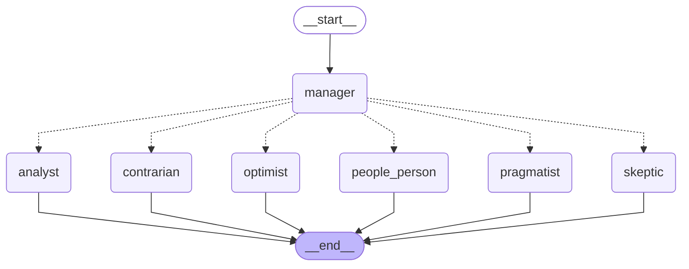

# m2-routing graph

```mermaid
---
config:
  flowchart:
    curve: linear
---
graph TD;
	__start__([<p>__start__</p>]):::first
	manager(manager)
	pragmatist(pragmatist)
	skeptic(skeptic)
	optimist(optimist)
	analyst(analyst)
	contrarian(contrarian)
	people_person(people_person)
	__end__([<p>__end__</p>]):::last
	__start__ --> manager;
	manager -.-> analyst;
	manager -.-> contrarian;
	manager -.-> optimist;
	manager -.-> people_person;
	manager -.-> pragmatist;
	manager -.-> skeptic;
	analyst --> __end__;
	contrarian --> __end__;
	optimist --> __end__;
	people_person --> __end__;
	pragmatist --> __end__;
	skeptic --> __end__;
	classDef default fill:#f2f0ff,line-height:1.2
	classDef first fill-opacity:0
	classDef last fill:#bfb6fc
```
