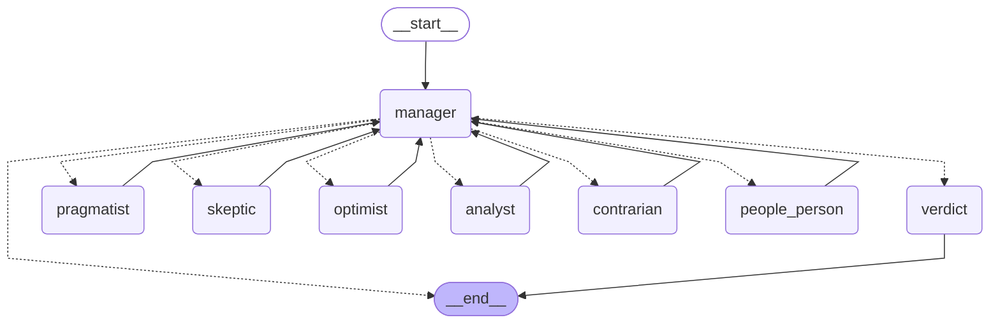

# m4-verdict-strategies graph

Two selectable routing strategies ("confidence": visible manager + explicit
verdict node; "background": silent manager, personas talk directly, "group"
delivers the verdict) share this exact node/edge shape — they differ only in
prompts and message visibility, not graph structure. Exported from the
default strategy ("confidence").

