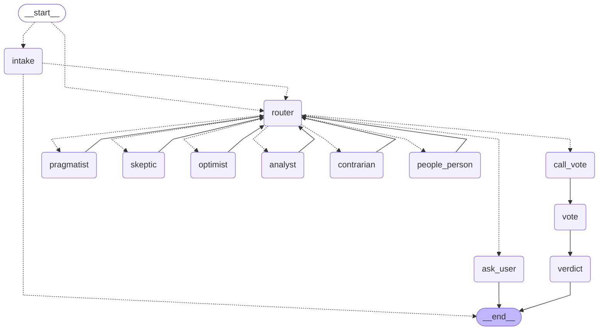

# m5-debate-mode graph

```mermaid
---
config:
  flowchart:
    curve: linear
---
graph TD;
	__start__([<p>__start__</p>]):::first
	intake(intake)
	router(router)
	ask_user(ask_user)
	call_vote(call_vote)
	vote(vote)
	verdict(verdict)
	pragmatist(pragmatist)
	skeptic(skeptic)
	optimist(optimist)
	analyst(analyst)
	contrarian(contrarian)
	people_person(people_person)
	__end__([<p>__end__</p>]):::last
	__start__ -.-> intake;
	__start__ -.-> router;
	analyst --> router;
	call_vote --> vote;
	contrarian --> router;
	intake -.-> __end__;
	intake -.-> router;
	optimist --> router;
	people_person --> router;
	pragmatist --> router;
	router -.-> analyst;
	router -.-> ask_user;
	router -.-> call_vote;
	router -.-> contrarian;
	router -.-> optimist;
	router -.-> people_person;
	router -.-> pragmatist;
	router -.-> skeptic;
	skeptic --> router;
	vote --> verdict;
	ask_user --> __end__;
	verdict --> __end__;
	classDef default fill:#f2f0ff,line-height:1.2
	classDef first fill-opacity:0
	classDef last fill:#bfb6fc
```
